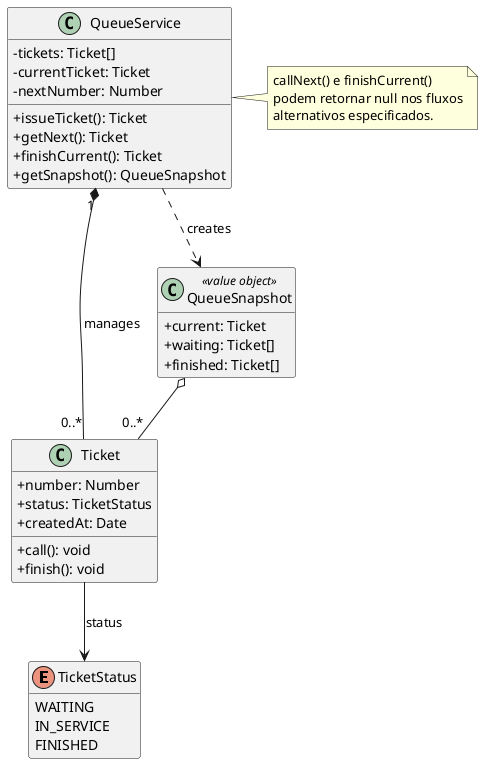

# Diagrama de classes do domínio

## Contratos complementares

- `Ticket.call()` aceita somente uma senha `WAITING`.
- `Ticket.finish()` aceita somente uma senha `CALLED`.
- Transição inválida lança `INVALID_TICKET_TRANSITION`.
- `QueueService.callNext()` lança `ACTIVE_TICKET_EXISTS` se já existe senha atual.
- `getSnapshot()` retorna novos arrays para impedir alteração externa da coleção do serviço.
