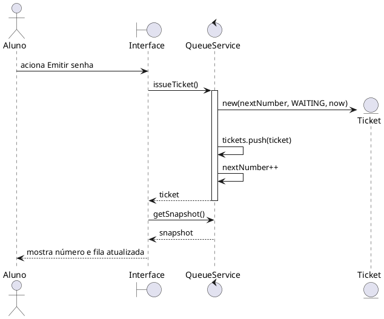

# Sequência — UC-01 Emitir senha

```plantuml
@startuml
actor Aluno
boundary Interface
control QueueService
entity Ticket

Aluno -> Interface: aciona Emitir senha
Interface -> QueueService: issueTicket()
activate QueueService
create Ticket
QueueService -> Ticket: new(nextNumber, WAITING, now)
QueueService -> QueueService: tickets.push(ticket)
QueueService -> QueueService: nextNumber++
QueueService --> Interface: ticket
deactivate QueueService
Interface -> QueueService: getSnapshot()
QueueService --> Interface: snapshot
Interface --> Aluno: mostra número e fila atualizada
@enduml
```

