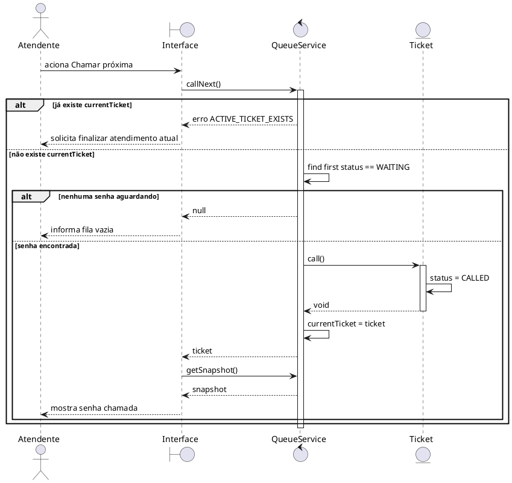

# Sequência — UC-02 Chamar próxima senha

```plantuml
@startuml
actor Atendente
boundary Interface
control QueueService
entity Ticket

Atendente -> Interface: aciona Chamar próxima
Interface -> QueueService: callNext()
activate QueueService

alt já existe currentTicket
  QueueService --> Interface: erro ACTIVE_TICKET_EXISTS
  Interface --> Atendente: solicita finalizar atendimento atual
else não existe currentTicket
  QueueService -> QueueService: find first status == WAITING
  alt nenhuma senha aguardando
    QueueService --> Interface: null
    Interface --> Atendente: informa fila vazia
  else senha encontrada
    QueueService -> Ticket: call()
    activate Ticket
    Ticket -> Ticket: status = CALLED
    Ticket --> QueueService: void
    deactivate Ticket
    QueueService -> QueueService: currentTicket = ticket
    QueueService --> Interface: ticket
    Interface -> QueueService: getSnapshot()
    QueueService --> Interface: snapshot
    Interface --> Atendente: mostra senha chamada
  end
end

deactivate QueueService
@enduml
```

