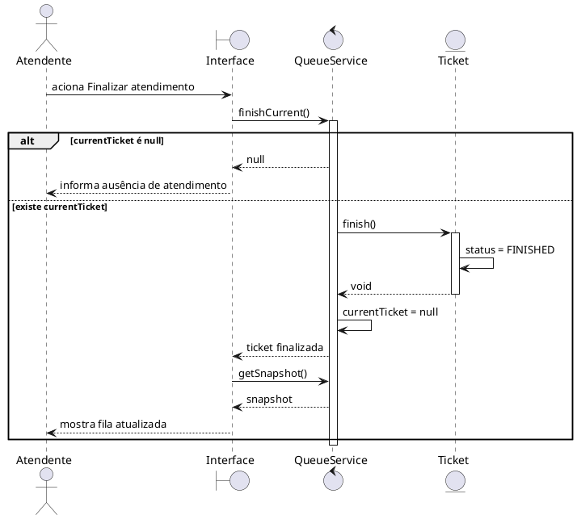

# Sequência — UC-03 Finalizar atendimento

```plantuml
@startuml
actor Atendente
boundary Interface
control QueueService
entity Ticket

Atendente -> Interface: aciona Finalizar atendimento
Interface -> QueueService: finishCurrent()
activate QueueService

alt currentTicket é null
  QueueService --> Interface: null
  Interface --> Atendente: informa ausência de atendimento
else existe currentTicket
  QueueService -> Ticket: finish()
  activate Ticket
  Ticket -> Ticket: status = FINISHED
  Ticket --> QueueService: void
  deactivate Ticket
  QueueService -> QueueService: currentTicket = null
  QueueService --> Interface: ticket finalizada
  Interface -> QueueService: getSnapshot()
  QueueService --> Interface: snapshot
  Interface --> Atendente: mostra fila atualizada
end

deactivate QueueService
@enduml
```

