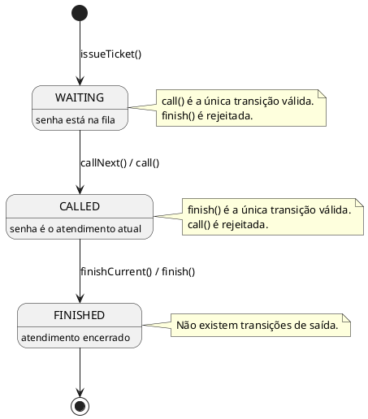

# Diagrama de estados da senha

```plantuml
@startuml
[*] --> WAITING : issueTicket()
WAITING --> CALLED : callNext() / call()
CALLED --> FINISHED : finishCurrent() / finish()
FINISHED --> [*]

WAITING : senha está na fila
CALLED : senha é o atendimento atual
FINISHED : atendimento encerrado

note right of WAITING
  call() é a única transição válida.
  finish() é rejeitada.
end note

note right of CALLED
  finish() é a única transição válida.
  call() é rejeitada.
end note

note right of FINISHED
  Não existem transições de saída.
end note
@enduml
```

## Política de transição

Qualquer operação de transição incompatível com o estado atual lança `INVALID_TICKET_TRANSITION` e mantém o estado anterior.
