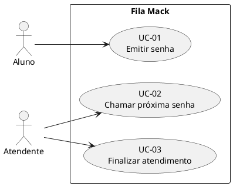

# Diagrama de casos de uso

## Catálogo

| ID | Nome | Ator principal |
|---|---|---|
| UC-01 | Emitir senha | Aluno |
| UC-02 | Chamar próxima senha | Atendente |
| UC-03 | Finalizar atendimento | Atendente |
| UC-04 | Consultar estado da fila | Aluno ou atendente |
